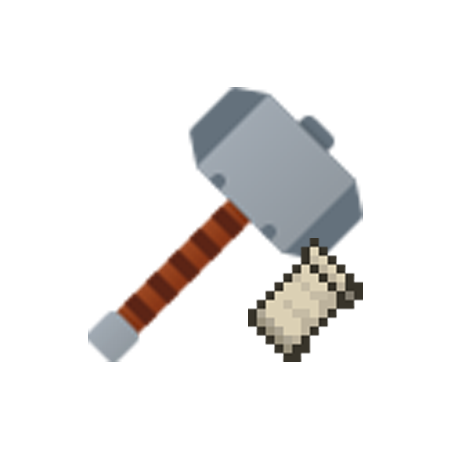

<center><div align="center">



# HardcodeText Patcher (WIP) ~~Vault Patcher~~ ~~（Vanilla Hardcoded Breaker）~~

Vault Patcher 的非官方 Fabric 移植版（WIP）。硬编码 -> 本地化。让一些mod中硬编码的字符串变为可以本地化的字符串。

ZH-CN / [English](README-EN.md)

</div></center>

# 配置文件

## 配置

在`config/HardcodePatcher/`下的格式为`config.json`和若干个`模块.json`。

`config.json`是必须的。 
如下：
```json
{
  "mods": [
    "模块"
  ],
  "debug_mode": {
    "is_enable": false,
    "output_mode": 0,
    "output_format": "<source> -> <target>"
  }
}
```
### 模块（mods）
`config.json`定义了`模块.json`，
`模块.json`才会被正常读取读取并使用。反之亦然。

### 调试模式（Debug Mode）
**(Tips: 仅供调试使用)**

`is_enable`决定调试功能是否开启。
若为`true`，那么会在替换字符串时向日志中输出一行调试信息，调试信息的格式由`output_format`决定，调试信息的内容由`output_mode`决定。
若为`false`，则不会在替换字符串时向日志中输出任何内容。

`output_format`决定了调试信息的格式，默认为`<source> -> <target>`。
`<source>`为源内容，即未做替换前的字符串；`<target>`为做替换后的字符串。
还有一个`<stack>`未展示出来，因为输出的很多，容易污染日志。
`<stack>`为堆栈跟踪数组，是此字符串所在类的`StackTrace`(包括本mod)，它更多是为`target_class`中的`stack_depth`和`name`服务的。

`output_mode`决定了调试信息的内容。
若为 0, 则仅输出替换的字符串；
若为 1, 则仅输出不被替换的字符串。

## 模块

模块的格式大概这样：

```json
[
  {
    "target_class": {
      "name": "",
      "mapping": "Intermediaty",
      "stack_depth": -1
    },
    "key": "I'm key",
    "value": "@I'm value"
  },
  {
    "target_class": {
      "name": "me.modid.item.relics",
      "mapping": "Intermediaty",
      "stack_depth": 3
    },
    "key": "Dragon Relic",
    "value": "namespace.modify.modid.item.relics.dragonrelic"
  },
  {
    "target_class": {
      "name": "",
      "mapping": "Intermediaty",
      "stack_depth": 0
    },
    "key": "Talents",
    "value": "namespace.modify.the_vault.gui.talnets"
  }
]
```
或者
```json
[
  {
    "key": "I'm key",
    "value": "@I'm value"
  },
  {
    "key": "Dragon Relic",
    "value": "namespace.modify.modid.item.relics.dragonrelic"
  },
  {
    "key": "Talents",
    "value": "namespace.modify.the_vault.gui.talnets"
  }
]
```

。其中，

```json
{
  "target_class": {
    "name": "",
    "mapping": "Intermediaty",
    "stack_depth": -1
  },
  "key": "I'm key",
  "value": "Im value"
}
``` 

就是一个翻译键值对，主要涉及到`key`、`value`和`target_class`。

### 键值对（key-value pair）

#### 键（Key）
`key`，顾名思义，指定的是要翻译的字符串。

如果我想翻译标题界面的``Copyright Mojang AB. Do not distribute!``，
那么可以指定`"key":"Copyright Mojang AB. Do not distribute!"`。

#### 值（Value）

有了键，还得有值。

那么我想将``Copyright Mojang AB. Do not distribute!``改为``Mojang AB.``。
那就可以指定`"value":"Mojang AB."`。

#### 半匹配
以上的方式均为全匹配（即完全替换），只替换与`key`相同的文本。

如果你想半匹配，或者原字符串中有格式化文本（例如`§a`、`%d`、`%s`等）。
那么可以在`value`的前面加上`@`字符，实现半匹配。

例子：
```json
{
  "key": "Grass",
  "value": "@CAO"
}
```
这样就会把所有的`Grass`都替换为`CAO`（包括`Grass Block`、`Grass`、`Tall Grass`）


这样一个基础的键值对就完成了。
应该是这样子的：

```json
{
  "target_class": {
    "name": "",
    "mapping": "Intermediaty",
    "stack_depth": 0
  },
  "key": "Copyright Mojang AB. Do not distribute!",
  "value": "Mojang AB."
}
```
或者
```json
{
  "key": "Copyright Mojang AB. Do not distribute!",
  "value": "Mojang AB."
}
```

例如

```json
{
  "target_class": {
    "name": "",
    "mapping": "Intermediaty",
    "stack_depth": -1
  },
  "key": "Copyright Mojang AB. Do not distribute!",
  "value": "Mojang AB."
}
```

## 高级配置

### 注入目标（target class）

`target_class`这个对象主要用于指定两个相同`key`的不同`value`。
简单解释下：

有一个GUI里面有`Close`（指关闭GUI）这个文本，另一个GUI也有`Close`（指关闭管道），

此时它们的含义不同，但是若不加上`target_class`，那么他们的翻译内容却是一样的。
所以要用到`target_class`。

`target_class`中有三个键：`name`、`mapping`和`stack_depth`。

### 类名（name）

类名的匹配规则大概是这样的：

#### 类匹配

* 以`#`开头的字符串会视为类匹配（示例：`#TitleScreen`会匹配`net.minecraft.client.gui.screen.TitleScreen`
  和`net.minecraft.client.gui.screen.titlescreen`
  但不匹配`net.minecraft.client.gui.titlescreen.screen`）

#### 包匹配

* 以`@`开头的字符串会视为包匹配（示例：`#net.minecraft.client`会匹配`net.minecraft.client.gui.screen.TitleScreen`
  和`net.minecraft.client.gui.screen.DeathScreen`等等
  也匹配`net.minecraft.client.gui.titlescreen.screen`）

#### 完全匹配

* 不以`#`或`@`开头的字符串会视为全匹配（示例：`net.minecraft.client.gui.screen.TitleScreen`会匹配`net.minecraft.client.gui.screen.TitleScreen`
  和`net.minecraft.client.gui.screen.titlescreen`
  但不匹配`net.minecraft.client.gui.titlescreen.screen`）

### 映射（mapping）

保留字段

### 堆栈深度（stack depth）

#### **(Tips: 过于复杂，不建议新手用)**
#### **(作者其实也不会)**

堆栈深度在堆栈中用于更精准的匹配类，
例如在如下堆栈中

```
java.base/java.lang.Thread.getStackTrace(Thread.java:1610), 
TRANSFORMER/minecraft@1.18.2/net.minecraft.client.gui.screen.TitleScreen(TitleScreen.java:3),
...
```

`net.minecraft.client.gui.screen.TitleScreen`的`stack_depth`就是2。
`stack_depth`的大小取决于要定位的堆栈所处的位置，
使用`stack_depth`时，`name`不能为模糊匹配。

例如：

```json
{
  "target_class": {
    "name": "net.minecraft.client.gui.screen.TitleScreen",
    "mapping": "Intermediaty",
    "stack_depth": 2
  },
  "key": "Copyright Mojang AB. Do not distribute!",
  "value": "Mojang AB."
}
```

此时便能精准的定位到`net.minecraft.client.gui.screen.TitleScreen`这个类。

### 参考配置

**_（用于Vault Hunter 3rd Edition）_**

```json
[
  {
    "target_class": {
      "name": "",
      "mapping": "Intermediaty",
      "stack_depth": 0
    },
    "key": "Attack Damage",
    "value": "namespace.modify.the_vault.gui.attackdamage"
  },
  {
    "target_class": {
      "name": "",
      "mapping": "Intermediaty",
      "stack_depth": 0
    },
    "key": "Dragon Relic",
    "value": "namespace.modify.the_vault.item.relics.dragonrelic"
  },
  {
    "target_class": {
      "name": "",
      "mapping": "Intermediaty",
      "stack_depth": 0
    },
    "key": "Talents",
    "value": "namespace.modify.the_vault.gui.talnets"
  }
]
```

如果你仔细看的话，那么你会发现，`target_class`这个键其实很少被使用。

## 其他

#### Fabric移植：TexTrue

#### 原开发团队：

- 作者：[FengMing](https://github.com/3093FengMing)

- 配置部分：[teddyxlandlee](https://github.com/teddyxlandlee)

- 想法：[yiqv](https://github.com/yiqv)

#### 原Mod地址：[github](https://github.com/3093FengMing/VaultPatcher)